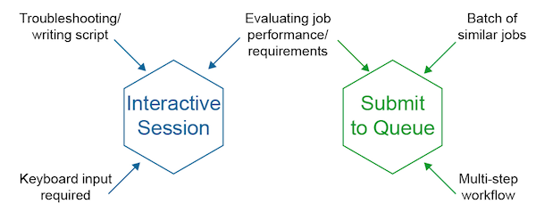
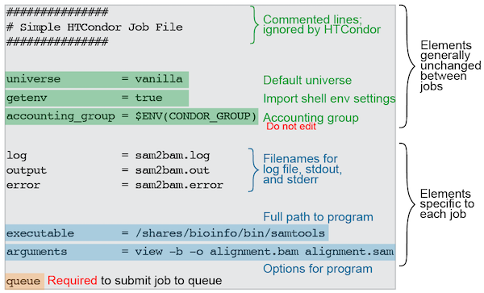
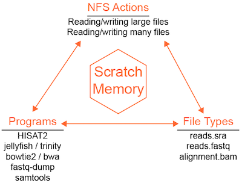
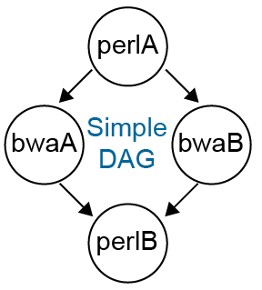
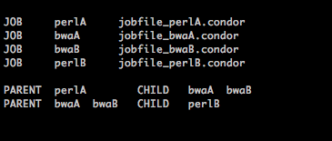

#HTCondor - Running Jobs

## Accessing HTCondor

**Currently all HTCondor transactions can be done from `stargate`.**

For work that needs to be done outside of the queue
(e.g. software development/debugging, small file operations, etc.),
an interactive session can be requested (see below). Jobs that require 
more than a few seconds or more than 1 CPU cannot be run on `stargate`.




## Submitting jobs to HTCondor

Instead of typing your command into the command line, you need to write
a job description file to submit the job to HTCondor. The basic job
description file is fairly simple.

###Anatomy of a simple HTCondor Job File




Universe sets which universe to execute your job in, default is vanilla.
Executable is the full path to the program you want to run. Getenv
(true/false) sets whether or not HTCondor should import your shell
environment settings into the job before submitting to the queue.
Alternatively, you can customize the shell environment on a per job
basis by setting getenv to false and using the environment configuration
option instead. Arguments are all the remaining options you would
normally put on the command line after the executable. Log, output and
error are the names (if desired) of an HTCondor log file and the job
standard output and error. Accounting group is a code to keep track of
your cluster usage based on your group (lab) membership. Accounting
group is automatically applied for your default group. If you need to
do work for another group you can manually override your default group.
Queue is a keyword for HTCondor that tells it to submit the code above to the
queue. This example job will request the default slot size (1 CPU, 4 MB
RAM, 3 KB disk space).


#####To submit this job to the queue:

```bash
condor_submit jobfile
```

###Requesting Multiple CPUs or Other Resrouces

If you need to submit a job that uses multiple CPUs or other significant
resources, add these requests to the job description file. In the
example below, the job file requests 30 CPUs in addition to the default
memory and disk request sizes.

```
####################
#
# Example Vanilla Universe Job
# Multi-CPU HTCondor submit description file
#
####################

universe         = vanilla
getenv           = true
request_cpus     = 30

log              = bowtie2.alignment.log
output           = bowtie2.alignment.out
error            = bowtie2.alignment.error

executable       = /bioinfo/bin/bowtie2
arguments        = -f --no-unal --threads 30 -x reference.fasta -U reads.fasta -S alignment.sam

queue
```

* Besides the job information, the only difference here is that we have
requested a **30 CPU** slot for this job. Note that it is important the the
request_cpus value matches any CPU request options in the submitted job 
(for example the `--threads` option in bowtie2).


After the job starts and the HTCondor monitoring system refreshes we can
now see this activity with `condor_status`:

```
Name               OpSys      Arch   State     Activity LoadAv Mem     ActvtyTime

slot1@aerilon.ddps LINUX      X86_64 Unclaimed Idle      0.000 257641  0+00:19:50
slot1_1@aerilon.dd LINUX      X86_64 Claimed   Busy     25.830  128  0+00:03:47
slot1@pegasus.ddps LINUX      X86_64 Unclaimed Idle      0.000 257769  0+00:14:55
                     Machines Owner Claimed Unclaimed Matched Preempting

        X86_64/LINUX        3     0       1         2       0          0

               Total        3     0       1         2       0          0
```

* Note that a partition, slot1_1 was split from slot1 (aerilon) and that
the load average (~26) is approximately equal to the 30 CPUs we
requested. This job took ~11 minutes (wall time) and checked out 30
CPUs, so 11 * 30 / 60 = 5.5 CPU hours. Viewed with
`condor_userprio -usage`:

```
Last Priority Update:  3/3  23:36
Group                     Res   Total Usage       Usage             Last
  User Name              In Use (wghted-hrs)    Start Time       Usage Time
------------------------ ------ ------------ ---------------- ----------------
group_jcarrington             0         5.53  3/03/2016 23:00  3/03/2016 23:26
  nfahlgren@ddpsc.org         0         5.53  3/03/2016 23:00  3/03/2016 23:26
------------------------ ------ ------------ ---------------- ----------------
Number of users: 1            0         5.53                   3/02/2016 23:37
```

To view a history of jobs you have submitted use
`condor_history <username>`.

## Other job configuration options

* `notification = <Always | Complete | Error | Never>`
  * Default = Never
* `notify_user =  <email-address>`
  * Default = `<username>@danforthcenter.org`
* `request_memory = <quantity><units>`
  * Quantity is the numeric amount of memory your job will maximally use
  * Units can optionally be appended to quantity. The default units are M/MB (megabytes). Other units are K/KB (kilobytes), G/GB (gigabytes), or T/TB (terabytes). Example: `request_memory = 1G`
* `request_disk   = <quantity><units>`
  * The same syntax as request_memory
  * The Danforth Center system uses an NFS shared filesystem, so requesting disk may not generally be necessary. Requesting disk is recommended if you are configuring jobs to use scratch space (see below).

## Interactive jobs

In general, most jobs should be submitted using job files, but in cases
where an interactive session is needed (for testing for example), shell
sessions can be requested from the HTCondor queue. Interactive sessions
are similar to logging into a server with ssh except that they will
automatically log out after 2 hours of inactivity and once disconnected
will terminate any running jobs, including `screen` and `tmux` sessions.

A simple interactive session with 1 CPU and 1 GB of RAM can be requested simply with:

```bash
condor_submit -interactive
```

If you need additional resources you can add job configuration key-value pairs
```bash
condor_submit -interactive request_cpus=10 request_memory=10G
```


* CPU and memory (RAM) can be requested
* Condor creates a mini-machine on one of the executable servers for your use
* Fees accrued regardless of usage once the session has started (since these resources are checked out and are unavailable to the queue)


## Job control

If you need to remove a job from the queue, find the job ID with `condor_q`:

```
-- Schedd: stargate.bioinformatics.danforthcenter.org : <10.5.1.63:15151?...
ID      OWNER            SUBMITTED     RUN_TIME ST PRI SIZE CMD
30.0   nfahlgren       3/3  22:43   0+00:00:02 R  0   3.2  samtools view -b -

1 jobs; 0 completed, 0 removed, 0 idle, 1 running, 0 held, 0 suspended
```

#####Then remove the job:

```bash
condor_rm 30
```

This will remove all jobs under the ID 30, including jobs submitted from
the same job file (e.g. 30.0, 30.1, etc.). If you need to remove a
specific job, use the float value instead.

#####Or remove all jobs associated with your username:

```bash
condor_rm username
```

## Running a condor job that uses the scratch space

Since the Danforth Center system uses NFS, transfer
of files is not done by default. File transfer can be useful for 
IO-constrained jobs or jobs that behave poorly on
NFS (e.g. HISAT2). Below are some examples of programs and
actions that benefit from using scratch space.



To active the transfer of input files, output files, or both, 
additional job file configuration is needed:

```
####################
#
# Example Vanilla Universe Job :: Using SCRATCH space
# ** Executable is NOT copied over **
# Multi-CPU HTCondor submit description file
#
####################

universe         = vanilla
getenv           = true
executable       = /bioinfo/bin/hisat2
arguments        = -q -x genome.fa -U singleEnd.fastq -S output.sam --rna-strandness R -p 20
log              = hisat2.groupID.log
output           = hisat2.groupID.out
error            = hisat2.groupID.error
request_cpus     = 20
request_memory   = 10G
transfer_executable = False
should_transfer_files = YES
when_to_transfer_output = ON_EXIT
transfer_input_files = <path to singleEnd.fastq if not in current dir>
# HTCondor will copy any input files listed here (comma-separated)
# HTCondor will transfer all output files since none are listed specifically

###################

queue
```

## Running multiple jobs with a single job file

The example below will run four cufflinks jobs, substituting the value
of `group` in every time `queue` is called.

- When running a batch of jobs from a single job file, if `notification = Complete` is set within
the job file, then you will receive an email after each individual job is completed. Not a problem
if a handful of jobs are being run, but if you are launching 100s-1000+ jobs, then neither your email 
nor the system is going to like that many emails. One approach is create a DAGman wrapper and submit 
the condor job file via `condor_submit_dag` with the command line argument `-notification complete` included. 
Then Condor will only email you once the entire suite of jobs have been completed. See below for more details
on DAG.

```
####################
#
# Example Vanilla Universe Job :: 
# This launches multiple jobs, using the 'group' variable info to find 
# and create the required files [this example would queue up 4 jobs]
# Multi-CPU HTCondor submit description file
#
####################

universe         = vanilla
getenv           = true
executable       = /bioinfo/bin/cufflinks
arguments        = -o output/$(group) --GTF-guide file.gtf -p 15 --library-type fr-firststrand -u -L $(group) $(group)_RNAseq.bam
log              = $(group).cufflinks.log
output           = $(group).cufflinks.out
error            = $(group).cufflinks.error
request_cpus     = 15
request_memory   = 10G

###################

group = controls_1
queue 1

group = controls_2
queue 1

group = controls_3
queue 1

group = controls_4
queue 1
```

## Running multiple jobs using a batch file

Rather than writing out each job queue statement as above, you can read data from an input file and use the data as
parameters for your condor job. Following the example above, you could create a text file with the group names:

file-of-groups.txt

```
controls_1
controls_2
controls_3
controls_4
```

Using the condor job file example above, you can use this file of group names to queue each job:

```
####################
#
# Example Vanilla Universe Job :: 
# This launches multiple jobs, using the 'group' variable info to find 
# and create the required files [this example would queue up 4 jobs]
# Multi-CPU HTCondor submit description file
#
####################

universe         = vanilla
getenv           = true
executable       = /bioinfo/bin/cufflinks
arguments        = -o output/$(group) --GTF-guide file.gtf -p 15 --library-type fr-firststrand -u -L $(group) $(group)_RNAseq.bam
log              = $(group).cufflinks.log
output           = $(group).cufflinks.out
error            = $(group).cufflinks.error
request_cpus     = 15
request_memory   = 10G

###################

queue group from file-of-groups.txt
```

The input file can also have multiple variables in a tab-delimited format:

file-of-vars.txt

```
output/controls_1    controls_1    controls_1_RNAseq.bam
output/controls_2    controls_2    controls_2_RNAseq.bam
output/controls_3    controls_3    controls_3_RNAseq.bam
output/controls_4    controls_4    controls_4_RNAseq.bam
```

Then assign multiple variables from the input file with queue:

```
####################
#
# Example Vanilla Universe Job :: 
# This launches multiple jobs, using the 'group' variable info to find 
# and create the required files [this example would queue up 4 jobs]
# Multi-CPU HTCondor submit description file
#
####################

universe         = vanilla
getenv           = true
executable       = /bioinfo/bin/cufflinks
arguments        = -o $(outdir) --GTF-guide file.gtf -p 15 --library-type fr-firststrand -u -L $(group) $(outfile)
log              = $(group).cufflinks.log
output           = $(group).cufflinks.out
error            = $(group).cufflinks.error
request_cpus     = 15
request_memory   = 10G

###################

queue outdir, group, outfile from file-of-vars.txt
```


## Running a sequential set of jobs: DAGman

#####Two ways to run a multiple-step pipeline: 

1. Using a shell script
2. Using a DAG: a directed acyclic graph (“DAG”) - details: <http://research.cs.wisc.edu/htcondor/manual/latest/2_10DAGMan_Applications.html>



###Advantages of DAGman Workflow over a Shell Script

-  Coordinates multiple jobs in serial **and** in parallel

-  Specifically request resources [CPUs; scratch diskspace; RAM] on a **per-job-basis**
	-  More cost-effective than just checking out i.e. 40 CPUs because one step of a pipeline uses 40 while the remainder use 1

- Error and log reporting for each job --> easier for troubleshooting

- Using a DAGman config file + 1 condor job file template avoids clutter

###Basic format of DAG file

The DAG input file has a basic set of commands: 

- JOB: specifies an HTCondor job
	- Syntax: `JOB JobName SubmitDescriptionFileName [DIR directory] [NOOP] [DONE]`
- PARENT CHILD: specifies the dependencies within the DAG
	- Syntax: `PARENT ParentJobName... CHILD ChildJobName...`

**Example DAG Input File**



###DAG Submission

A DAG is submitted to the queue using `condor_submit_dag DAG_InputFilename`

- Note: Notifications are set by default to NONE; to be notified that 
a DAG has completed, add the flag `-notification complete` to the `condor_submit_dag` command


###DAG Wrapper for Batch Condor Job File
When submitting a HTCondor job file to the queue that contains 100s+ jobs, if you wish to have 
an email notification once all jobs are complete, a simple approach is adding a DAG wrapper around
the job file - with no changes needed to the job file itself.

#####Example DAG Wrapper File Contents:

```

JOB  perl1 condor.jobs.perl.sh  


```

#####Example condor.jobs.perl.sh Contents:

```
universe                 = vanilla
getenv                   = true

condor_output            = outputs_condor/

request_cpus             = 1
run_type                 = perl

ID                       = $(Cluster).$(Process)
output                   = $(condor_output)$(run_type).$(ID).out
error                    = $(condor_output)$(run_type).$(ID).err
log                      = $(condor_output)$(run_type).$(ID).log

executable               = script.pl
arguments                = -i $(filename).fastq -o $(filename).fasta

filename                 = WT_1
queue

filename                 = WT_2
queue

filename                 = WT_3
queue
```

DAG will launch the three jobs. By running `condor_submit_dag -notification complete dag.sh`
DAG will launch the 3 jobs within the job file and send an email once all three have completed.
